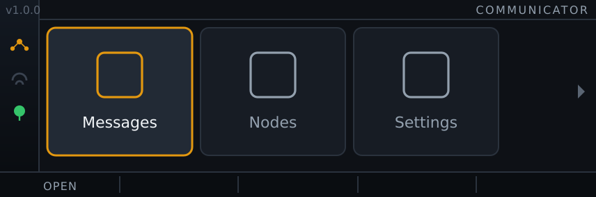
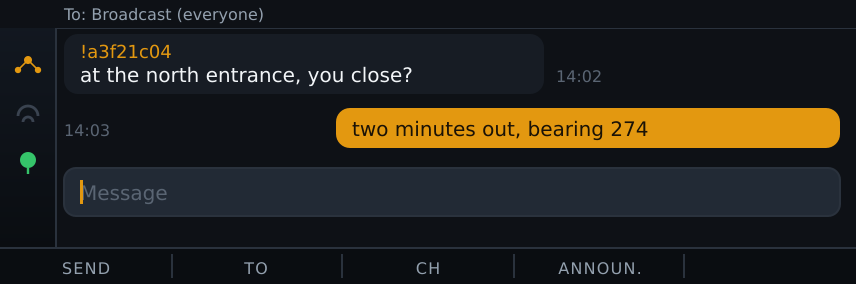
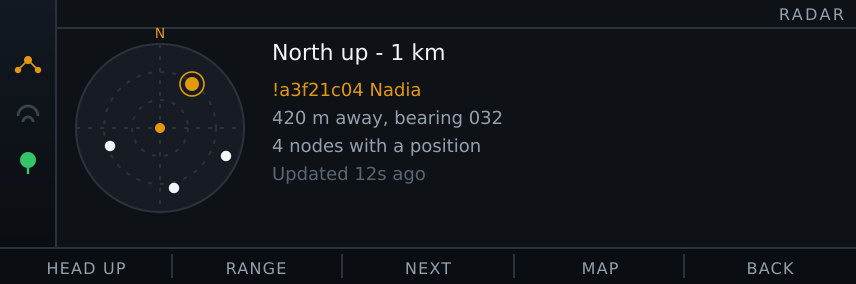
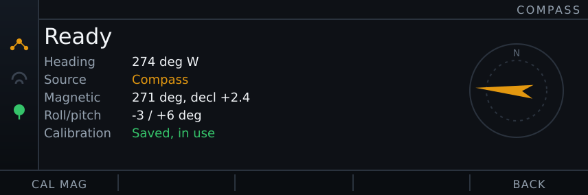
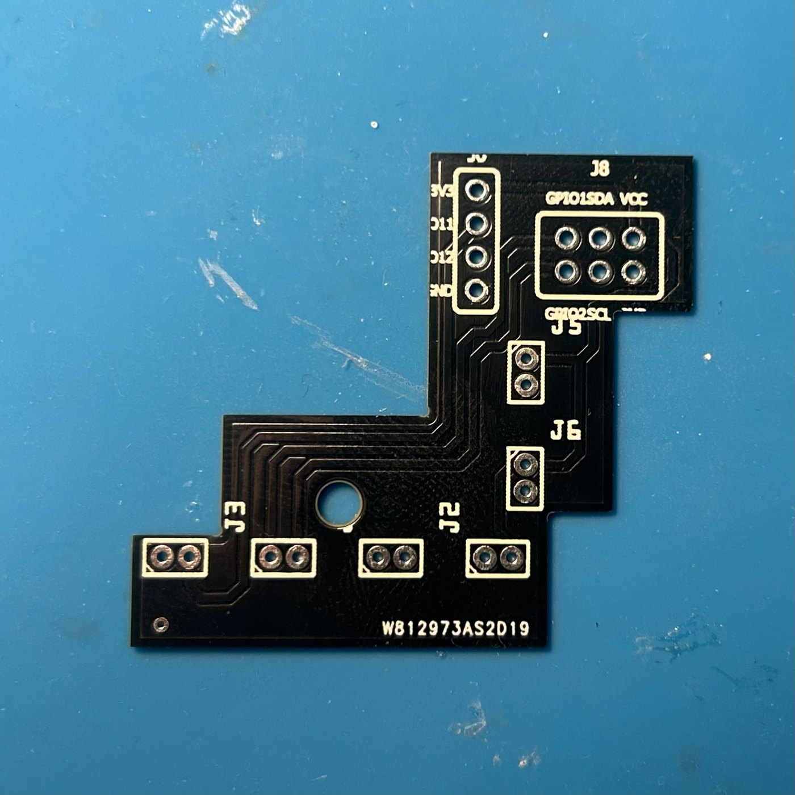
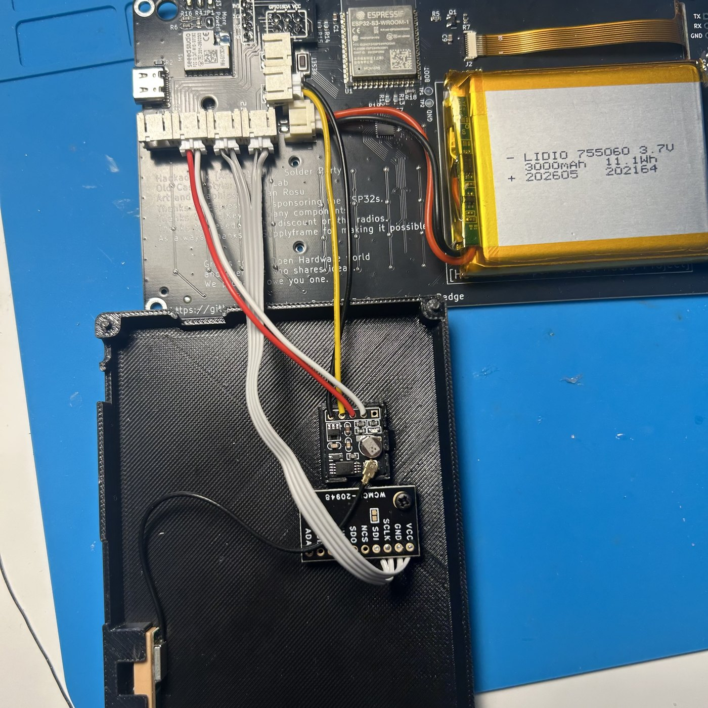
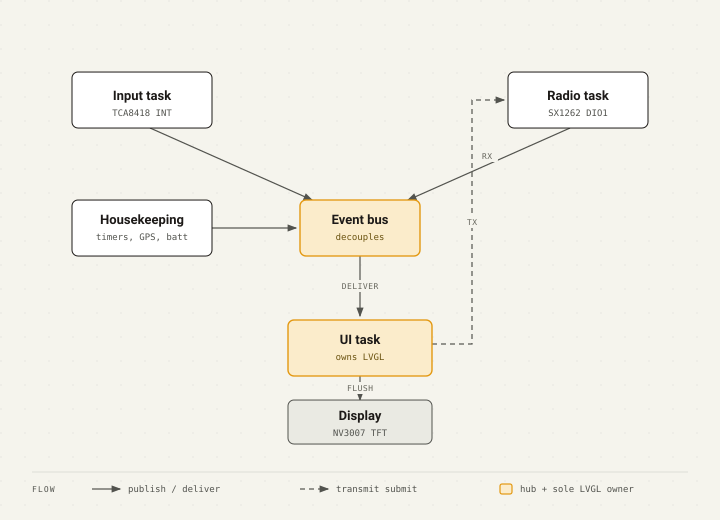

<h1 align="center">Communicator Badge firmware</h1>

<p align="center">
  Native C / ESP-IDF Meshtastic firmware for the Hackaday 2024 Supercon Communicator badge.
</p>

<p align="center">
  <a href="https://github.com/giovi321/had-badge-mod/actions/workflows/docs.yml"></a>
  <a href="https://github.com/giovi321/had-badge-mod/releases/latest"></a>
  <a href="LICENSE.txt"></a>
  
  
  
</p>

<p align="center">
  <a href="https://giovi321.github.io/had-badge-mod/"></a>
</p>

This firmware turns the Supercon 2024 Communicator badge into a Meshtastic messenger. It joins a mesh, exchanges encrypted text with other badges, Meshtastic devices, and the phone app, and drives a monochrome LVGL interface on the badge's own keyboard and screen. Twelve apps sit behind a scrolling launcher, from the chat screen to a tilt-compensated compass and an offline vector map.

> Replaces the stock `lvgl_micropython` demo. Flashing is reversible: you can put the original image back over USB whenever you want.

## What it looks like

428 x 142 pixels, one amber accent on a dark surface, and a keyboard instead of a touchscreen. Every screen is driven from the same chrome: a status sidebar that stops at the bar, a right-aligned title, and five function keys whose labels always name what the next press does.

<table>
<tr>
<td width="50%"></td>
<td width="50%"></td>
</tr>
<tr>
<td>Twelve apps behind a scrolling strip</td>
<td>Encrypted text with anything speaking Meshtastic</td>
</tr>
<tr>
<td></td>
<td></td>
</tr>
<tr>
<td>Radar puts your people on a scope, with an offline map under the blips</td>
<td>Fit an IMU and the scope turns while you stand still</td>
</tr>
</table>

Those four are rendered from the firmware's own layout constants and colour tokens rather than photographed off the panel, so the geometry is exact and the anti-aliasing is kinder than a camera.

## Runs on a stock badge, flashed over USB

Flashing needs no rework: nothing has to be desoldered and nothing has to be added. The badge is an ESP32-S3, so an ESP-IDF 5.1 or newer toolchain and a USB cable are the whole requirement. This release is built on ESP-IDF 6.2.

| Part | Detail |
|------|--------|
| MCU | ESP32-S3-WROOM, 8 MB octal PSRAM, 16 MB flash |
| Display | NV3007 TFT, 428x142, SPI |
| Radio | Semtech SX1262 LoRa |
| Keyboard | TCA8418 I2C matrix |
| Flash layout | Two 3 MB OTA app slots plus about 9.6 MB of SPIFFS |

Every pin number is defined in one place, `components/bsp/include/board_pins.h`. The optional GPS, compass and vibration motor are covered below.

## Quick start

With ESP-IDF active in your shell, from the repository root:

```bash
idf.py set-target esp32s3
idf.py build
idf.py -p <PORT> flash monitor
```

First boot blank or white? That is almost always stale NVS left by the previous firmware. Run `idf.py -p <PORT> erase-flash` once, then flash again. See [Build and flash](https://giovi321.github.io/had-badge-mod/getting-started/building/) and [First boot](https://giovi321.github.io/had-badge-mod/getting-started/bring-up/) for the rest.

## What it does

- Meshtastic messaging over LoRa: encrypted text with other badges, Meshtastic devices and the phone app, on the real wire format, with the channel hash, flags, nonce layout and sync word pinned as known-answer tests in `host_tests/`
- Twelve apps behind a horizontally scrolling launcher: Messages, Nodes, Settings, Diagnostics, GPS, Breadcrumbs, Follow, Packets, Tracker, Radar, Map and Compass
- Range and bearing views for finding people: Radar plots nodes on a PPI scope, Map draws them over an offline basemap, and Tracker, Follow and the Nodes rows point a needle at one node
- A web UI over WiFi that backs up and restores settings, flashes a new image into the spare OTA slot, and uploads offline maps
- Useful with the screen off: the keyboard and radio wake the CPU rather than being polled, the CPU scales its frequency with tickless idle, and the on-board D1 LED blinks briefly every 3 s while a message is unread

## Optional hardware and its default pins

Three optional peripherals fit on the badge's two expansion headers, and between them they take every signal pin those headers carry. All three default to enabled, and with nothing fitted each logs one line at boot and the badge runs normally. Every pin below is a setting, so the assignment is a default and not a constraint.

| Peripheral | Part | Default pins (ESP GPIO) | Header | Setting keys |
|------------|------|-------------------------|--------|--------------|
| Compass | TDK ICM-20948, AK09916 magnetometer on a second die | SDA 4, SCL 5 | J8, the SAO I2C pair | `imu_enabled`, `imu_sda_pin`, `imu_scl_pin`, `imu_addr_hi`, `mag_decl_ddeg`, `mag_cal_use` |
| GPS | ATGM336H, NMEA over UART | ESP RX 7, ESP TX 6 | J8, the SAO spare GPIO pair | `gps_enabled`, `gps_rx_pin`, `gps_tx_pin` |
| Vibration motor | any 3.3 V motor behind a driver transistor | 12 | J6, the IO12 pad | `vibe_enabled`, `vibe_pin`, `vibe_ms`, `vibe_on_msg` |
| Notification LED | D1, already fitted on the stock badge | 1 | on the board, active low | `led_enabled`, `led_pin`, `led_active_lo`, `led_on_msg`, `led_beat_s` |

What each one buys:

- The compass gives a tilt-compensated heading that holds while you stand still. Tracker, Follow and the Nodes needles take it with no toggle; Radar and Map default to north-up and use it once F1 selects heading-up. Calibrate the magnetometer once with a sweep in the Compass app, then set `mag_decl_ddeg` to your local declination in tenths of a degree, east positive. GPS course over ground is the fallback above 1 knot
- The GPS gives position, course over ground, breadcrumb tracks in SPIFFS, and a clock the badge sets itself
- The motor buzzes for `vibe_ms` milliseconds on an incoming message, 180 ms by default, which makes the badge useful in a pocket with the screen off
- D1 blinks for an unread message the way a BlackBerry did: 60 ms every 3 seconds until you read them. One monochrome LED means the vocabulary is timing rather than colour, so there is also an idle heartbeat you can switch on. Diagnostics F1 and F2 fire the motor and the LED once each, because a peripheral that either moves or does not is faster to test with a keypress than with a second device

The GPS default is the SAO spare GPIO pair rather than J6 because the compass takes the SAO I2C pair and the motor takes J6's IO12 pad. J6 still works: set `gps_rx_pin` to 12 and `gps_tx_pin` to 11, and move or disable the motor first. Two labels mislead. SAO numbering runs against ESP numbering, so SAO_GPIO1 is ESP GPIO7 and SAO_GPIO2 is ESP GPIO6. The J6 silkscreen "IO12" reads as "IO10" at a glance, and GPIO10 is the LoRa antenna switch, not a J6 pin at all. Full wiring is in [Board and pins](https://giovi321.github.io/had-badge-mod/hardware/overview/).

Two fabricable extras live in this repo:

- A 3D-printable case with a bay for the GPS module, in [`hardware/case/`](hardware/case/)
- A back-side PCB that breaks J6 and J8 out to JST sockets, so modules plug in instead of being soldered, in [`hardware/internal-addon-board/`](hardware/internal-addon-board/)

The addon board exists because soldering three peripherals onto two bare 2.54 mm headers, inside a case, with wires that have to come off again, gets old fast. It solders once onto J6 and J8 and turns them into six keyed sockets: one pair per function, so a module plugs in without anyone counting pins.

<table>
<tr>
<td width="50%"></td>
<td width="50%"></td>
</tr>
<tr>
<td>Rev C as fabricated, before the sockets go on</td>
<td>Fitted, with the GPS and the compass wired into the case</td>
</tr>
</table>

## Offline vector maps

Radar and Map draw an OpenStreetMap vector basemap (roads and water) under the node blips. Build one for your area on a PC, then upload it over WiFi:

```bash
# Export your area as GeoJSON from https://overpass-turbo.eu, then:
python tools/osm2vmap.py --geojson area.geojson --out map.vmap
```

Open `http://<badge-ip>/map` to upload `map.vmap`. Radar shows it on F4 and needs a GPS fix to place it; the Map app draws it with no toggle and free-pans without a fix on F3. Either way the map has to cover the area you are looking at. See [Offline maps](https://giovi321.github.io/had-badge-mod/development/maps/) for the full walkthrough.

## Host tests

The portable logic runs on a PC with no badge attached: 1113 checks over the Meshtastic codec, AES and channel crypto, the node database, NMEA parsing, radar and map projection, the compass maths, and UI layout. With the bundled `zig cc` compiler:

```bash
python -m pip install ziglang
pwsh tools/run_host_tests.ps1
```

A `host_tests/CMakeLists.txt` is also provided for gcc or clang with CMake. See [Host tests](https://giovi321.github.io/had-badge-mod/development/host-tests/).

## Repo layout

Anything that can be tested on a PC lives in a portable component and is compiled into both the firmware and `host_tests/`. Hardware access is confined to `drivers/`, and only the UI task touches LVGL.

```
main/                           app_main.c, the boot sequence
components/
  core/  mesh/  util/           portable C11, also compiled into host_tests
  net/  ui/                     router and LVGL widgets; their portable/ subdirs are host-tested
  bsp/                          board_pins.h and app_config.h, the single pin map
  drivers/  radio/              ESP-IDF hardware access
  services/                     background tasks (mesh, GPS, compass, WiFi, web)
  apps/                         the twelve app screens
  ble/                          NimBLE companion link
host_tests/                     portable test suite
tools/                          host-test runner and the OSM vector-map converter
hardware/case/                  3D-printable case (STL + notes)
hardware/internal-addon-board/  J6+J8 breakout PCB (Fritzing + gerbers)
docs/                           Astro + Starlight documentation site
```

<p align="center">
  
</p>

See [Conventions](https://giovi321.github.io/had-badge-mod/development/conventions/) for the rules those boundaries enforce, and the [architecture overview](https://giovi321.github.io/had-badge-mod/architecture/overview/) for how the tasks fit together.

## What has actually been verified

Confirmed on hardware:

- The firmware builds clean for the `esp32s3` target and the host-test suite passes: 1113 checks, 0 failures
- A badge flashed with it boots cleanly, with the GPS, the vibration motor and the notification LED coming up on their default pins
- The ICM-20948 is detected and identified over I2C: `WHO_AM_I` reads `0xEA` and the AK09916 magnetometer inside it answers and enters continuous mode. So the register map, the user-bank switching, the bypass path to the second die and the identification checks all work against the real part

Not confirmed:

- Heading accuracy. The compass reports a heading, but it has not been compared against a known reference, and the axis transform between the two dies and the calibration sweep are unproven in the field. The maths behind them is host-tested, which is a different claim
- The magnetometer calibration gate accepts a sweep that never tilts the badge, which leaves the vertical axis offset tens of uT out. That error cancels while the badge is level and grows as it tips, so sweep with real tilt. Closing the gap properly needs a sphere-residual check
- Battery charge. This badge has no battery sense circuit at all: `VBAT` never reaches an MCU pin, so the sidebar hides the icon rather than showing an empty one. The settings to enable it exist for anyone who adds a divider by hand
- Radar, the web UI tools (settings backup and restore, and OTA update), and the multi-channel threaded UI are in the build but have not had a device check

## Roadmap

- Waypoint and POI manager: save, name, navigate to and share points over the mesh
- BLE channel and contact provisioning, so onboarding needs no typing
- A piezo buzzer for notification tones alongside the motor

## License

MIT, see [LICENSE.txt](LICENSE.txt). Uses [LVGL](https://lvgl.io), [nanopb](https://jpa.kapsi.fi/nanopb/), and the [Meshtastic](https://meshtastic.org) protocol.
