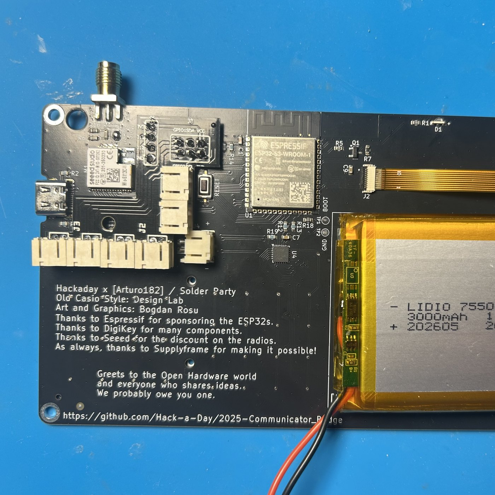
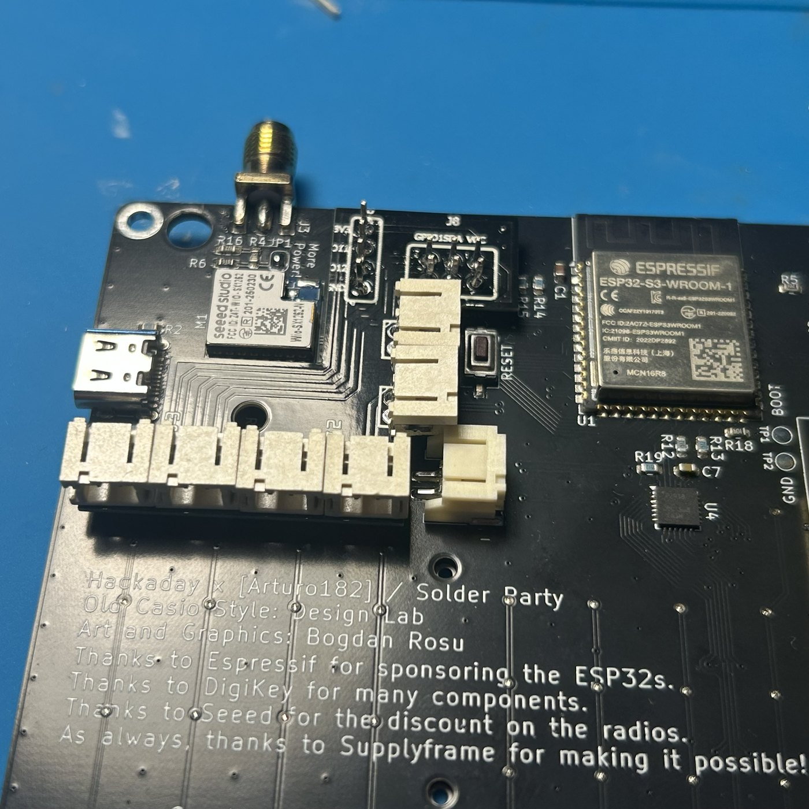

`hardware/internal-addon-board/` holds a small PCB that turns the badge's two expansion headers into
JST sockets, so a GPS module, a compass or a motor plugs in instead of hanging off soldered wires. It
mounts on the back of the badge main board, soldered onto J8 (the SAO port) and J6 (the
GPS/expansion header). The lower part of the board is a plain tab that gets hot-glued to the badge, so
the whole thing rides inside the case.

The board outline and every hole position come from the official badge KiCad design
([Hack-a-Day/2025-Communicator_Badge](https://github.com/Hack-a-Day/2025-Communicator_Badge), MIT),
mirrored to the back view, so every dimension is a file value rather than a measurement off a photo.

Rev C as it comes back from the fab, before the sockets are populated. The two hole clusters at the
top are what solders onto the badge; the lower arm is the tab that gets hot-glued.

Fitted, with the sockets populated. The board sits over the flat passive area and keeps clear of the
SX1262, the RST button, the USB-C connector and the battery JST.

The sockets face outward so a cable can be pulled without a tool and without lifting the board.

## Badge header pinout

Both headers are 2.54 mm through-holes, empty on the stock badge. Both VCC pins are the same 3.3 V
rail. There is no 5 V on either header, and the ESP32-S3 pins are not 5 V tolerant, so every
peripheral on the addon board must be a 3.3 V device.

| Connector | Pin | Signal | ESP32-S3 GPIO |
|-----------|-----|--------|---------------|
| J8 (SAO) | 1 | 3V3 | - |
| J8 | 2 | GND | - |
| J8 | 3 | I2C SDA | 4 |
| J8 | 4 | I2C SCL | 5 |
| J8 | 5 | GPIO1 | 7 |
| J8 | 6 | GPIO2 | 6 |
| J6 | 1 | 3V3 | - |
| J6 | 2 | UART TX (badge out) | 11 |
| J6 | 3 | UART RX (badge in) | 12 |
| J6 | 4 | GND | - |

The 3.3 V rail is sized for the badge itself. Small sensors are fine; power-hungry modules are not. If
something genuinely needs 5 V, put a boost converter on the addon board.

## Six sockets, one functional pair each

The addon board does not mirror the badge headers one to one. It groups the pins into functional pairs
and gives each pair its own 2-pin socket (2 mm pitch, JST-style), six sockets in total:

- one I2C pair, SDA and SCL (the compass)
- one GPIO pair, GPIO7 and GPIO6 (the GPS UART by default)
- one UART pair, IO11 and IO12 (the J6 signals; IO12 is the vibration motor by default)
- three power pairs, each 3V3 and GND

With the firmware defaults, the three optional peripherals land on three different sockets: the
compass on J4 (the I2C pair), the [GPS](/had-badge-mod/apps/gps/) on J3 (the two SAO GPIOs), and the
vibration motor on J1 pin 1 (IO12, J6's old GPS RX pad). All of those pins are settings, so the
assignment is a default rather than a constraint.

Both modules wired and dropped into the printed case: the GPS with its antenna connector, and an
ICM-20948 breakout on the I2C socket. Ribbon rather than single cores, because three peripherals on
loose wires inside a closed case is how joints break.

Each module plugs into one power pair plus the signal pair it needs, so up to three modules ride the
board at once and swap without soldering. The exact pin-per-socket table is in the folder
[README](https://github.com/giovi321/had-badge-mod/tree/main/hardware/internal-addon-board).

## The outline dodges everything tall on the badge back

The outline is a 42.0 x 37.5 mm polygon that covers the two headers and the flat passive areas, and
keeps clear of everything tall or that you still need to reach: the SX1262 radio module, the RST
button, the USB-C connector, the battery JST and the SMA antenna. The attenuator bypass jumper JP1
also stays uncovered. `placement-overlay.png` shows the outline drawn over the badge back with all
corner coordinates.

Edge clearances are tight by design: SX1262 0.34 mm, RST 0.52 mm, battery JST 0.30 mm, USB-C 0.41 mm.
Fabs hold the outline to about +-0.2 mm, so the tightest gaps can come back near 0.1 mm. That is fine
for a board that is soldered and glued in place, but print `board-shape.svg` at 100% scale and lay it
on the badge before ordering. If it rubs, a few strokes of sandpaper on the SX1262 or battery-side
edge fix it.

One thing the KiCad file does not contain is component heights. The areas the board covers hold only
passives and SOT-23 packages by footprint, which normal 2.5 mm header standoff clears, but verify on
your badge during the dry fit. Also check the board against the
[printed case](/had-badge-mod/hardware/case/) if you use it, since both live on the back of the badge.

## Designing in Fritzing

Everything needed is in `hardware/internal-addon-board/`:

1. Import the two badge parts (File > Open on each `.fzpz` in `fritzing-parts/`). Both show the badge from the back
2. In PCB view, select the board, and in the Inspector load `board-shape.svg` as a custom shape
3. Place the cluster part at board x + 21.0, board y - 0.5. Its ten holes then sit exactly on J6 and J8. Lock it
4. Optionally place the full-board part at board x - 2.5, board y - 2.5 as a live picture of the badge underneath. Delete it before exporting gerbers, its reference silkscreen would print on the addon board
5. Set the grid to 0.254 mm. The two headers are 4.7 x 1.4 pitches apart, so they never both land on a 2.54 mm grid
6. Route with wide traces (12 to 16 mil signals, 20 mil and up for 3V3 and GND) and add a ground fill on the bottom

## Order it as a standard 6/6 mil board

Any standard service handles this board. On the PCBWay order form pick the standard 6/6 mil
track/spacing class, not a finer one; the routed board does not go below 10 mil anywhere and finer
classes only add cost. Drills are 0.7 to 1.016 mm with standard pads, no slots, single lamination.

The gerber export of the sketch is in the folder, zipped (`internal-addon-board-gerbers.zip`) and
unzipped (`gerber/`). The board outline is the `_contour.gm1` layer. Some online previews render only
the bounding box until the outline layer is processed, so check the shape in a real gerber viewer, not
the upload thumbnail.

## Solder it to standoff headers, then glue the tab

1. Solder standoff pin headers into J6 and J8 from the back of the badge
2. Seat the addon board on the pins, check it floats level and touches nothing, then solder
3. Press RST once to confirm the button survives with the board in place
4. Hot-glue the bottom tab to the badge

The Fritzing sketch is `internal-addon-board.fzz`; the folder
[README](https://github.com/giovi321/had-badge-mod/tree/main/hardware/internal-addon-board) carries
the full coordinate tables for reworking the outline or the placement.
